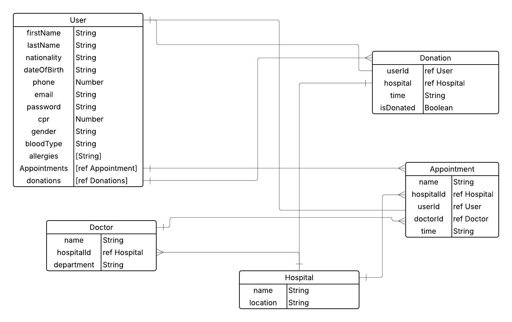
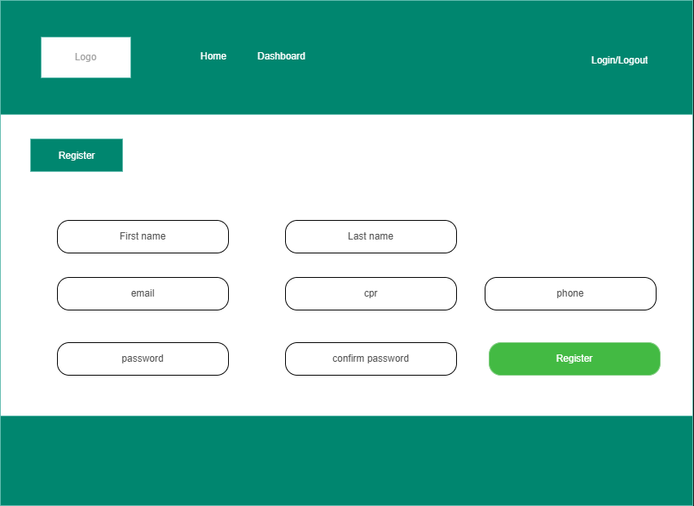
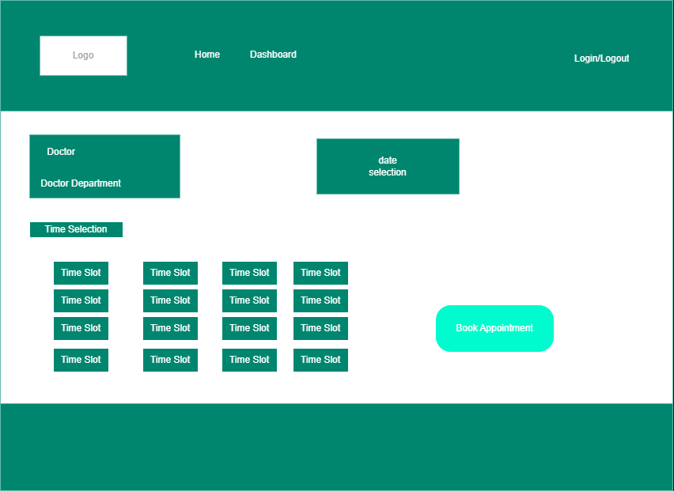

# MedAppoint

## Date: 12/6/2025

### By: Hasan Maaraj, Saud Aljar, Naim Jalal

#### [GitHub](https://github.com/HasanMaaraj) | [GitHub](https://github.com/SAljar99) | [GitHub](https://github.com/Naimjalal)

---

### **_Description_**

**Medappoint** is a full-stack hospital appointment and blood donation management system.

It allows users to:

- Book appointments with doctors across multiple hospitals.
- Track blood donations and manage donor registrations.
- Access personal profiles to view & edit personal and medical details.

This system aims to solve:

- Difficulty in booking appointments in busy hospitals like Salmaniya.
- Long waiting lists.
- Lack of centralized donation tracking across hospitals.
- Provide an organized, secure, user-friendly experience.

---

## Features

## Features

- 🔒 Secure User authentication with JWT
- 🩸 Blood donation registration & history tracking
- 🗓️ Appointment booking, editing, and cancellation
- 🏥 Multiple hospitals & departments supported
- 👨‍⚕️ Doctor listing & specialty selection
- 👤 User profile management (Edit profile feature)
- 📋 MongoDB relationships across multiple collections (users, doctors, hospitals, appointments, donations)
- 🔐 Protected Routes with token-based authorization

---

# 🧩 Entity Relationship Diagram (ERD)

---

# WireFrames

## 

## 🛠️ Technologies Used

- Backend: Node.js / Express.js
- Frontend: React.js with Vite
- Database: MongoDB with Mongoose
- Authentication: JWT
- Deployment: Fly.io (Backend), Surge (Frontend)
- Project Management: Trello (User Stories & Task Board)
- Wireframe: draw.io (Wireframes and Planning)
- ERD Diagram: Lucidchart

---

## 🔗 Live Links

- 🔗 Backend Repository: [medappoint-backend](https://github.com/Naimjalal/medappoint-backend)

🔗 Frontend Repository: [medappoint-frontend](https://github.com/Naimjalal/medappoint-frontend)

- 🔗 Trello Board: [View Trello](https://trello.com/b/ojg9NhU0/basic-board)

- 🔗 Deployment: _Coming soon on Fly.io and Surge_

---

### **_Future Updates_**

- Admin dashboard for hospital management
- Appointment reminders via email/SMS
- Hospital availability & dynamic slot scheduling
- Blood donation campaigns & notifications

---

### **_Credits_**

##### Markdown Guide: [ia.net](https://ia.net/writer/support/general/markdown-guide)

##### ChatGPT: [chat.openai.com](https://chat.openai.com)

---
